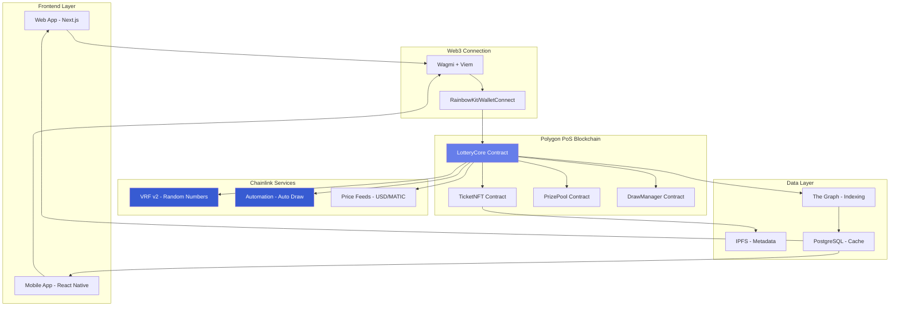
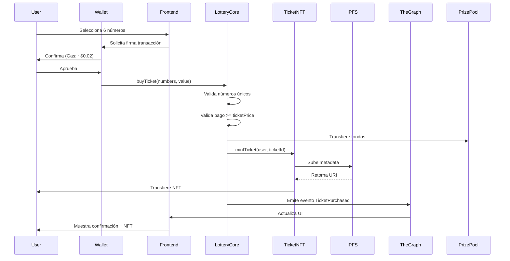
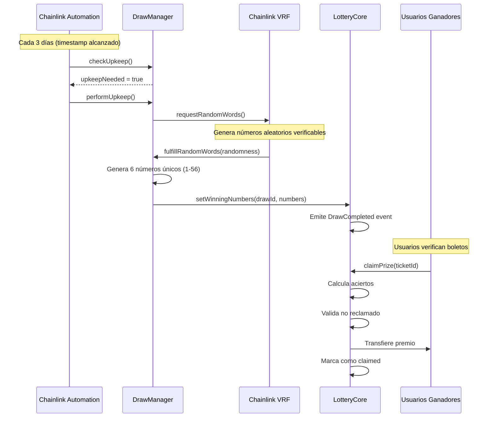
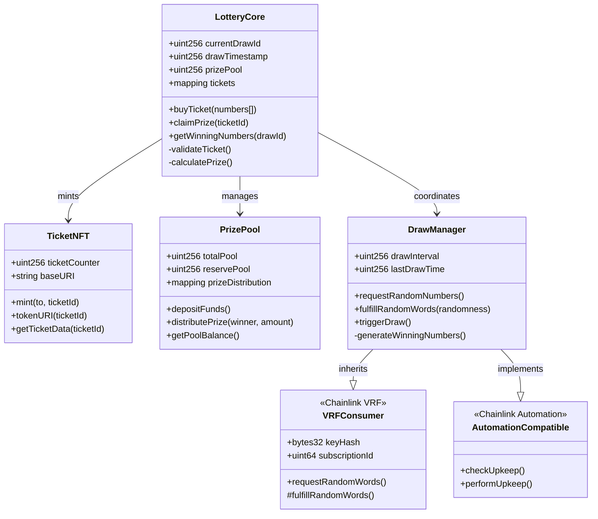
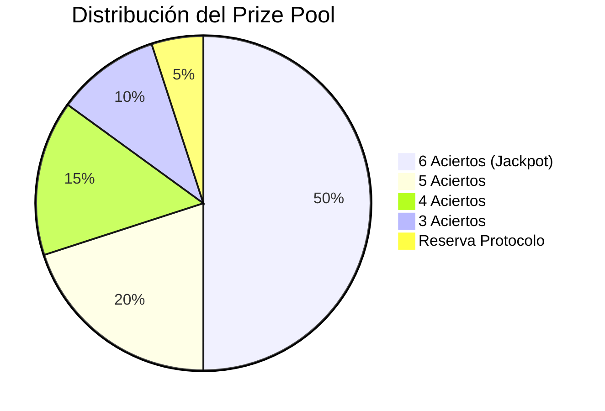
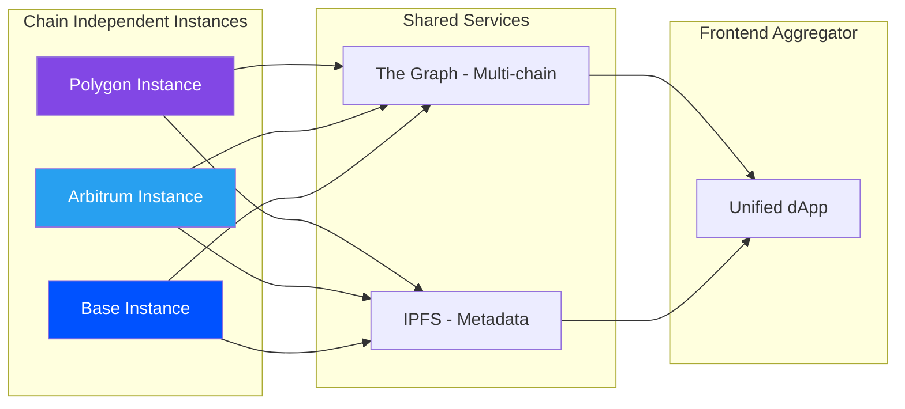
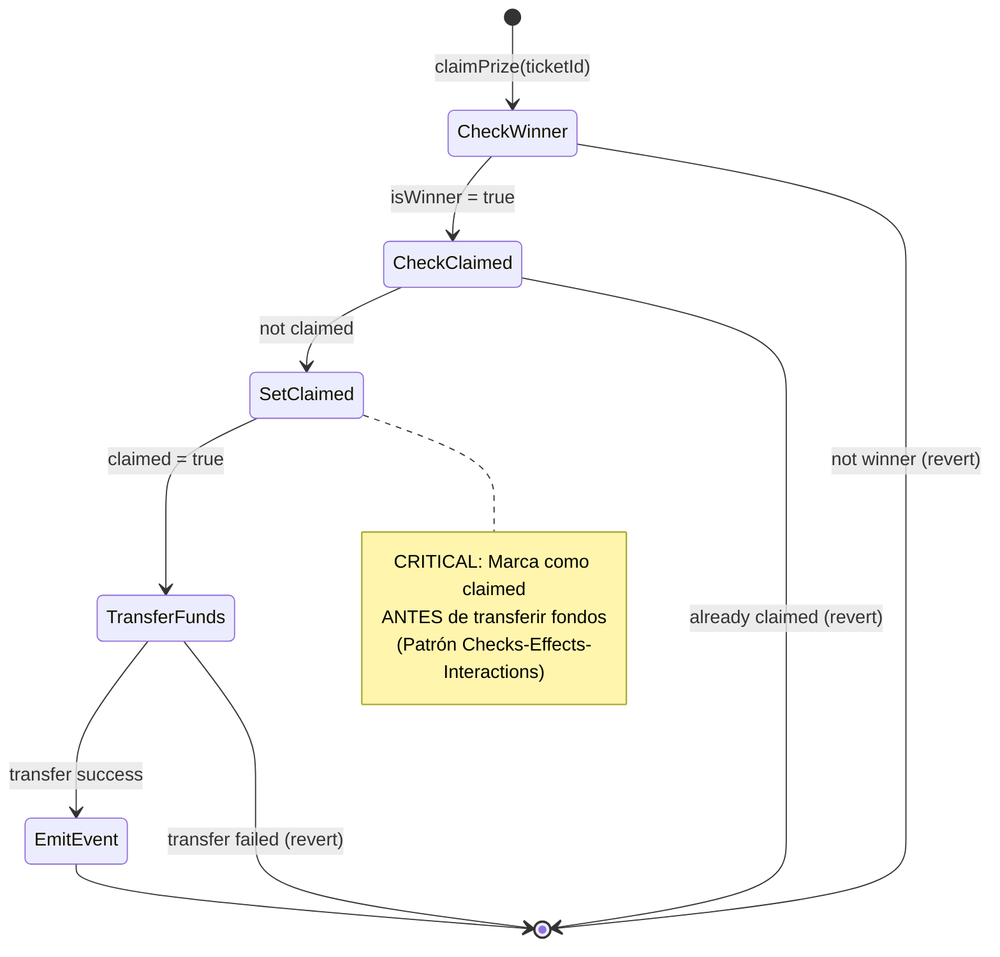
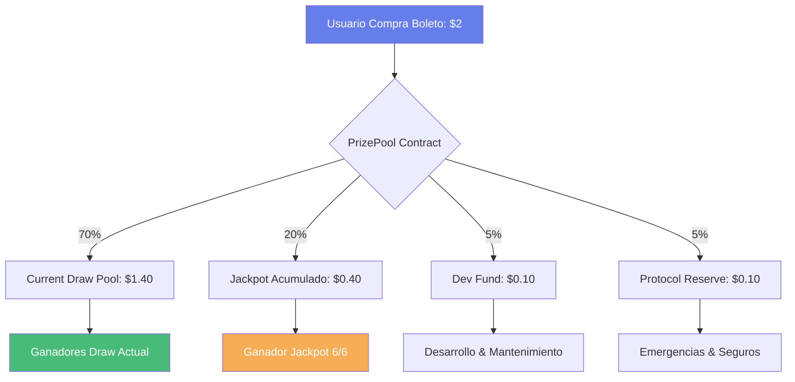
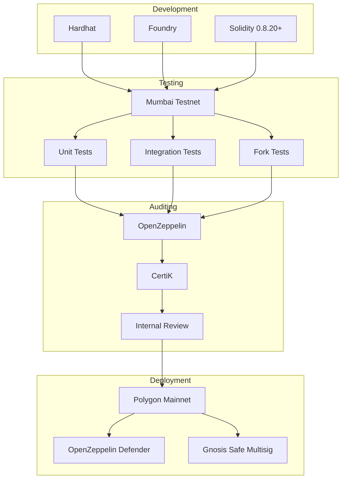
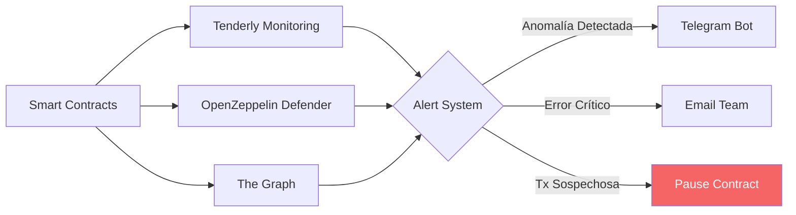

# 🎰 LOTERÍA BLOCKCHAIN - DIAGRAMAS TÉCNICOS DETALLADOS

## DIAGRAMA 1: Arquitectura General del Sistema



## DIAGRAMA 2: Flujo de Compra de Boleto



## DIAGRAMA 3: Flujo de Sorteo Automático



## DIAGRAMA 4: Arquitectura de Smart Contracts



## DIAGRAMA 5: Distribución de Premios



## DIAGRAMA 6: Estrategia Multi-Chain (Fase 2)



## DIAGRAMA 7: Flujo de Seguridad - Prevención de Reentrancy



## DIAGRAMA 8: Tokenomics y Flujo de Fondos



## DIAGRAMA 9: Stack de Desarrollo y Deploy



## DIAGRAMA 10: Monitoring y Alertas



## CONSIDERACIONES TÉCNICAS CLAVE

### 1. Generación de Números Aleatorios (CRÍTICO)

**❌ NUNCA USAR:**
```solidity
// INSEGURO - Manipulable por mineros
uint256 random = uint256(keccak256(abi.encodePacked(block.timestamp)));
uint256 random = uint256(blockhash(block.number - 1));
```

**✅ USAR SIEMPRE:**
```solidity
// SEGURO - Chainlink VRF
function requestRandomWords() external onlyOwner {
    requestId = COORDINATOR.requestRandomWords(
        keyHash,
        subscriptionId,
        requestConfirmations,
        callbackGasLimit,
        numWords
    );
}
```

### 2. Patrón Checks-Effects-Interactions (Anti-Reentrancy)

```solidity
function claimPrize(uint256 ticketId) external nonReentrant {
    // 1. CHECKS
    require(isWinner[ticketId], "Not winner");
    require(!claimed[ticketId], "Already claimed");
    require(msg.sender == ticketOwner[ticketId], "Not owner");
    
    // 2. EFFECTS
    claimed[ticketId] = true;
    
    // 3. INTERACTIONS
    (bool success, ) = msg.sender.call{value: prize}("");
    require(success, "Transfer failed");
}
```

### 3. Upgradability Pattern

```solidity
// Usar UUPS Proxy Pattern (OpenZeppelin)
import "@openzeppelin/contracts-upgradeable/proxy/utils/UUPSUpgradeable.sol";

contract LotteryCore is UUPSUpgradeable, OwnableUpgradeable {
    function _authorizeUpgrade(address newImplementation) 
        internal override onlyOwner {}
}
```

### 4. Gas Optimization

```solidity
// Optimizar lectura/escritura de storage
struct Ticket {
    address player;      // 20 bytes
    uint48 drawId;       // 6 bytes (suficiente para 281 billones de sorteos)
    uint8[6] numbers;    // 6 bytes
    bool claimed;        // 1 byte
    // Total: 33 bytes en 1 slot = GAS EFICIENTE
}
```

### 5. Emergency Mechanisms

```solidity
// Circuit breaker para emergencias
bool public paused;

modifier whenNotPaused() {
    require(!paused, "Contract paused");
    _;
}

function emergencyPause() external onlyOwner {
    paused = true;
    emit EmergencyPaused(block.timestamp);
}
```

---

## RESUMEN EJECUTIVO

### ✅ Decisión Final: POLYGON PoS

**Justificación Técnica:**
1. **Costos**: $0.02/tx vs $15+ en Ethereum
2. **Velocidad**: 7,000 TPS vs 30 TPS en Ethereum
3. **Seguridad**: Chainlink VRF nativo y probado
4. **Adopción**: Amplio soporte de wallets y exchanges
5. **Desarrollo**: EVM compatible, stack conocido

### 🚀 Roadmap

| Fase | Timeline | Objetivo |
|------|----------|----------|
| **MVP** | Mes 1-4 | Deploy en Polygon, primer sorteo |
| **Expansión** | Mes 5-8 | Arbitrum + Base deployment |
| **Scale** | Mes 9-12 | Optimizaciones, governance token |

### 💰 Proyección de Costos

**Desarrollo MVP:**
- Smart Contracts Development: $15,000 - $25,000
- Frontend Development: $10,000 - $20,000
- Auditoría (CertiK/OpenZeppelin): $20,000 - $40,000
- Legal & Compliance: $10,000 - $30,000
- **TOTAL**: $55,000 - $115,000

**Operación Mensual:**
- Chainlink VRF: $100 - $500/mes
- Chainlink Automation: $50 - $200/mes
- Infraestructura (RPC, IPFS): $200 - $500/mes
- Monitoring & Support: $500 - $1,000/mes
- **TOTAL**: $850 - $2,200/mes

---

*Documento generado por experto en Blockchain Architecture & Security*
*Versión 1.0 - Febrero 2026*
